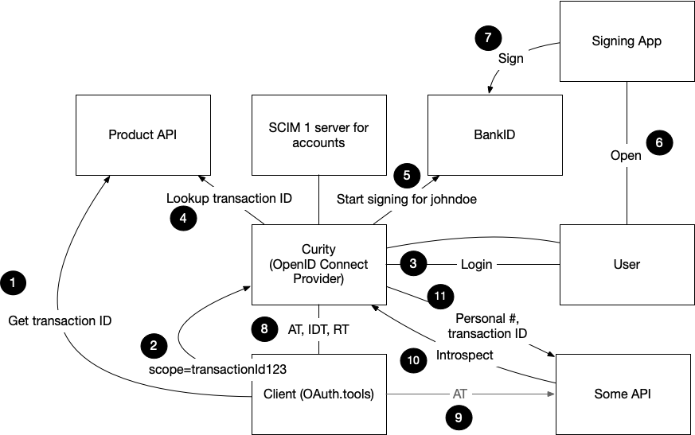
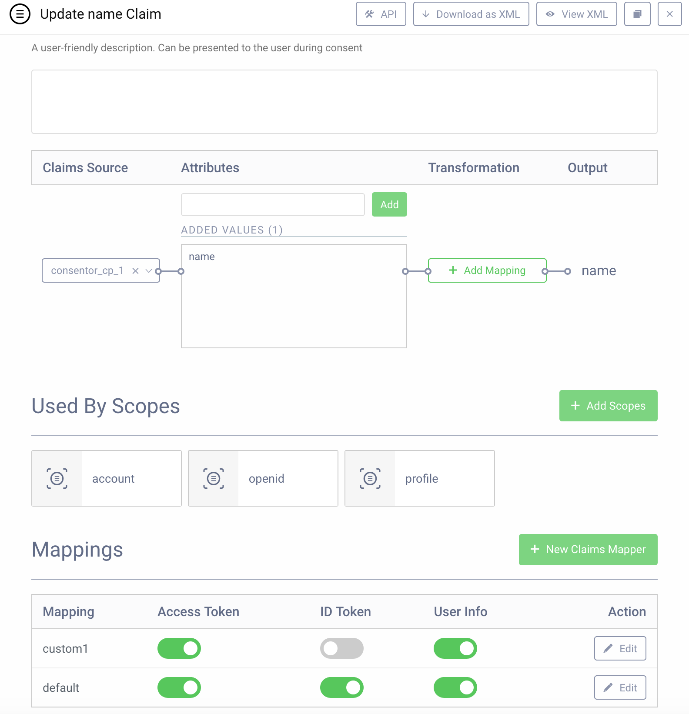
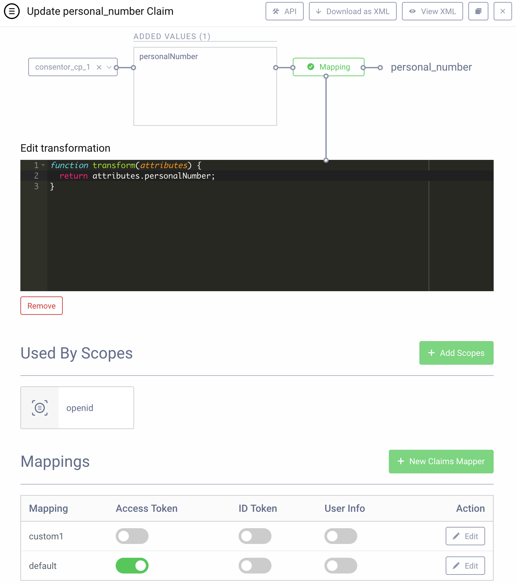

# Claims Consentor Demo
The files in this repo were used to perform a demonstration of some features of the Curity Identity Server. In particular, it showed:

* What a claims provider is and how to configure and work with a script claims provider and a consentor claims provider
* What prefix scopes are and how they can be used to avoid scope explosion
* How to seup a BankID signing consentor and how to configure an OAuth client to use that to digitally sign the interactive user consent. Part of this setup was to configure a script that would call a Web service to convert a transaction ID into some text that would be shown to the user for signing.
* How to configure an OAuth client to use these scopes, claims, and digital signing consentor

The scenario that was demonstrated is depicted in the following diagram:



1. Create a new product by calling the product API. This returns a transaction ID (e.g., `123`)
2. Make an OAuth authorization request appending the transaction ID obtained in step 1 to the prefix scope `transactionId` to form a scope like `transactionId123`.
3. User logs in (using username/password in the demo).
4. Get the transaction ID from the end of the prefix scope, and use that to call the product API. The result is the product details as JSON like this:

	```json
	{
	    "amount": "2",
	    "currency": "USD",
	    "product": "coffee"
	}
	```

5. Convert the product info and the client name into some text that will be signed. This is done in the configuration of the BankID signing consentor and is shown below.
6. User is shown the text on the web page rendered by Curity and prompted to open their signing application.
7. The user opens their signing application where they see the same text to be signed. They enter their password, completing the signing process.
8. Curity is made aware of the signature completion process and returns an Access Token (AT), ID Token (IDT), and Refresh Token (RT). 
9. The client sends the AT to some API. 
10. This token is opaque, so the API looks it up using Curity's introspection API. 
11. The response includes the transaction ID obtained from the script claims provider and the personal number obtained from the BankID signing consentor claims provider. The API compares the transaction ID in the introspection response with the one requested on the URI. If they are the same, it looks up the product for the transaction ID and thanks the user for their purchase; otherwise, it returns an access denied error.

[OAuth.tools](https://oauth.tools) was used to drive this flow together with a sample API and the configuration setup in Curity. This configuration and the API are described below.

## BankID Consentor

As described in the video, there are three important parts of the consentor configuration:

1. The HTTP client used to call the BankID API (step 5 in the diagram above)
2. The Web service and HTTP client used to call the product API (step 4)
3. The script that transforms the suffix of the prefix scope (i.e., the end part of the wildcard scope) into a transaction ID which is looked up at the product API and is then made into a textual message that is shown to the end user. This script is in the [consentor.xml](consentor.xml) config, and reprinted below for convenience:

```javascript
function result(context) {
    var clientId = context.client.name;
    var scopes = context.consentAttributes.scopes;
    var transactionIdScope = scopes.get(0);    
    var transactionId = transactionIdScope.replace("transactionId", "");
    var HashMap = Java.type("java.util.HashMap");
    var hm = new HashMap();
    hm.put("transactionId", transactionId);
    var query = new HashMap();
    query.put("query", hm)
    var response = context.getWebServiceClient().get(query);
    
    if (response.statusCode != 200)
    {
        throw exceptionFactory.forbiddenException(
            "bad response status " + response.statusCode)
    }
    
    var responseBody = response.getBody();
    var responseData = JSON.parse(responseBody);
    
    if (!responseData.product || responseData.product == "Unknown")
    {
        logger.error("Product web service did not return a " +
            "product for the transaction " + transactionId);
            
        throw exceptionFactory.internalServerException()
    }
    
    return "Do you want to allow '" + clientId + "' to purchase '" +
        responseData.product + "' for '" + responseData.amount + "' " + 
        responseData.currency + "?";
}
```

## Claims Providers

There are two important claims providers used in this demo. These obtain claims from various sources. The demo explains that the account details are provided by an account manager claims provider. This is typical setup together with the authentication subject attributes and context attributes claims providers, so those aren't demoed. What the demo concentrates on is two other claims providers:

1. A consentor claims provider and
2. A script claims provider 

The consentor claims provider gets the name attribute and personal number attribute from the BankID signing service after the user signs the transaction. (Personal number in Sweden is similar to a social security number in the US of civic registration number in other countries.)

The script claims provider looks through all the scopes and finds the `transactionId` prefix scope. As long as this one is approved, it is used when the `trasaction_id` claim is asserted. To do this, the script claims provider is configured to run the following procedure:

```javascript
function result(context) {
	var transactionId = "unknown";
	
	context.scopeValues.forEach(function(it) {
	    if (it.name.startsWith("transactionId"))
	    {
	        transactionId = it.name.replace("transactionId", "");
	    }
	});
		
	return { "transaction_id" : transactionId };
}
```

## Claims
The claims used in this demo are these three:

1. `name`
2. `transaction_id`
3. `personal_number`

The value of the name claim is provided by the BankID consentor claims provider and the attribute value is used as is. It is mapped to the ID token, user info, and access token. This claim is used in the `openid`, `profile`, and `account` scopes. (Only the `openid` scope's usage is shown in the demo.) The configuration of this claim looks like this in the admin UI:



The XML configuration for this can be found in [claims.xml](claims.xml).

The `transaction_id` claim is very straightforward and only requires the typical configuration for a claim. The `personal_number` claim uses the BankID signing consentor as the source of the claim value. That component refers to the attribute as `personalNumber`. To convert that to `personal_number` (i.e., to use snake-case instead of camel-case), a claim value transformation script is used. This script was simply this:

```javascript
function transform(attributes) {
  return attributes.personalNumber;
}
```

This script and the rest of the `personal_number` claims definition are in the [claims.xml](claims.xml) and shown in the following screenshot of the admin UI:



## Prefix Scope

The `transactionId` scope is created and defined to be a prefix scope. This allows the client to send any suffix it wishes. In other words, it can make an authorization request for any scope that begins with `transactionId`. The user authorizes or allows the entire value. For instance, if the client appends a transaction ID of `2` to this prefix scope and sends it as `transactionId2`, then the user authorizes the entire value, `transactionId2`. It is not valid for the client to send a scope without a suffix. In other words, it cannot send `transactionId` just. This scope configuration is shown in the following listing:

```xml
 <scope>
	<id>transactionId</id>
	<is-prefix>true</is-prefix>
</scope>
```

## Client Configuration

The last part of the configuration that's needed is an OAuth client (or OpenID Connect Relying Party as the case may be). The important parts of the configuration are these:

* The client is allowed to request the `openid` and `transactionId` prefix scope.
* It uses the default claims mapper.
* User consent is enabled, and only the BankID signing consentor is configured to run.
* OAuth.tools is setup as an allowed redirect URI.

This configuration is included in [client.xml](client.xml).

## Product API

The product API isn't part of Curity. It's the component within the system that a customer of Curity would build and setup. It does a few things in this demo:

1. Create new transaction IDs for some given product details (a product name, a purchase amount, and some currency that the purchase is being made in). This is used initially to obtain the suffix part of the wildcard scope. 
2. The API also provides a lookup capability that will return the product details for some transaction ID. This is used by the consentor script in Curity to obtain the details that are shown to the user prior to signing. These are "internal" operations of the API, so they aren't OAuth protected (though they would be in actual setup). These are included in the [api.py](api.py) sample code.
3. The last thing that the API demonstrates is how claims-based authorization can be performed by the API. 

The API exposes an operation where the client (OAuth.tools in the demo) can call to see if the transaction has been completed. This is protected by a by-reference (or opaque) access token. To ensure that this operation is secured and authorized by the end user, it has wired up the [Flask OAuth filter](https://github.com/curityio/oauth-filter-for-python-flask) that introspects the by-ref token. Using the transaction ID obtained in that response, it compares the URI of the requested transaction. If they are the same, the API looks up the product for the approved transaction ID and returns a message, thanking the user for their purchase. If the transaction IDs do not match, however, access to the requested resource is denied.

All of this is included in [api.py](api.py), but the salient parts are these:

```python
@app.route('/<int:transaction_id>', methods=["GET"])
@_refOauth.protect(scopes=["transactionId"], isPrefix=True)
def get_product(transaction_id):
    authorized_transaction_id = -1

    for scope in re.split("\\s+", g.scope):
        if scope.startswith("transactionId"):
            authorized_transaction_id = int(scope.replace("transactionId", ""))
            break

    if authorized_transaction_id == transaction_id:
        data = _lookup_product(transaction_id)

        return "Thank you for purchasing a %s for %s %s" % (
            data["product"], data["amount"], data["currency"])
    else:
        abort(401)
```

## Demo

With all this setup and running, the demo can be run. To see this, [check out the following video](https://youtu.be/iNlVBcqaKG8):

<iframe width="560" height="315" src="https://www.youtube.com/embed/iNlVBcqaKG8" frameborder="0" allow="accelerometer; autoplay; encrypted-media; gyroscope; picture-in-picture" allowfullscreen></iframe>
